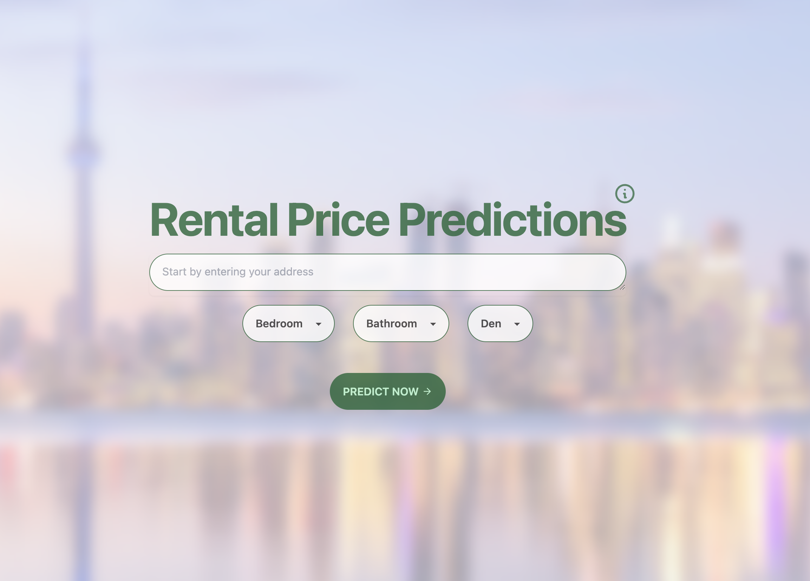

<!-- Improved compatibility of back to top link: See: https://github.com/othneildrew/Best-README-Template/pull/73 -->
<a name="readme-top"></a>
<!--
*** Thanks for checking out the Best-README-Template. If you have a suggestion
*** that would make this better, please fork the repo and create a pull request
*** or simply open an issue with the tag "enhancement".
*** Don't forget to give the project a star!
*** Thanks again! Now go create something AMAZING! :D
-->

<!-- PROJECT SHIELDS -->
<!--
*** I'm using markdown "reference style" links for readability.
*** Reference links are enclosed in brackets [ ] instead of parentheses ( ).
*** See the bottom of this document for the declaration of the reference variables
*** for contributors-url, forks-url, etc. This is an optional, concise syntax you may use.
*** https://www.markdownguide.org/basic-syn tax/#reference-style-links
-->

<!-- PROJECT LOGO -->
<br />
<div align="center">
  <!-- <a href="https://github.com/othneildrew/Best-README-Template">
    
  </a> -->

  <h3 align="center">Toronto Rental Price Prediction</h3>

  <p align="center">
    <div>
      </img>
    </div>
    <br />
    <a href="https://github.com/tutuCH/toronto_rental_prediction"><strong>Explore the docs »</strong></a>
    <br />
    <br />
    <a href="https://tutuch.github.io/toronto_rental_prediction/">View Demo</a>
    ·
    <a href="https://github.com/tutuCH/toronto_rental_prediction/issues">Report Bug</a>
    ·
    <a href="https://github.com/tutuCH/toronto_rental_prediction/issues">Request Feature</a>
  </p>
</div>

<!-- TABLE OF CONTENTS -->
<details>
  <summary>Table of Contents</summary>
  <ol>
    <li>
      <a href="#about-the-project">About The Project</a>
      <ul>
        <li><a href="#built-with">Built With</a></li>
      </ul>
    </li>
    <li>
      <a href="#getting-started">Getting Started</a>
      <ul>
        <li><a href="#prerequisites">Prerequisites</a></li>
        <li><a href="#installation">Installation</a></li>
      </ul>
    </li>
    <li><a href="#usage">Usage</a></li>
  </ol>
</details>

<!-- ABOUT THE PROJECT -->
## About The Project

The website is a rental price predictor for properties in Toronto. It uses a neural network regression model trained on past rental data to make predictions. The dataset can be found <a href="https://www.kaggle.com/datasets/rajacsp/toronto-apartment-price?resource=download">here</a> The frontend is built with React and TypeScript, while the backend is built with Flask. The user can enter the details of a property and the website will predict the rental price based on the provided information.

<p align="right">(<a href="#readme-top">back to top</a>)</p>

## Steps to Train the Model
1. Gather data from <a href="https://www.kaggle.com/datasets/rajacsp/toronto-apartment-price?resource=download">Kaggle</a>
2. Use the Geoapify API to convert the address of the rental property to its corresponding longitude and latitude.
3. Normalize the data, which involves scaling the features to a range of values that are easier to work with.
4. The Rectified Linear Unit (ReLU) function is then used as the activation function in the neural network model.
5. The Adam optimizer is chosen to optimize the model's weights and biases during training.
6. The mean absolute error (MAE) is used as the evaluation metric to assess the accuracy of the model.

Once the model is trained, it can be used to predict rental prices for new addresses in Toronto.

### Built With

* Frontend &ensp;&ensp;&ensp; React
* <a href="https://github.com/tutuCH/toronto-rental-prediction-backend">Backend &ensp;&ensp;&ensp;&ensp;Flask</a>
* <a href="https://github.com/tutuCH/toronto_rental_prediction_model">Model &ensp;&ensp;&ensp;&ensp;&ensp;&ensp;Tensorflow</a>

<p align="right">(<a href="#readme-top">back to top</a>)</p>

<!-- GETTING STARTED -->
## Getting Started

This is an example of how you may give instructions on setting up your project locally.
To get a local copy up and running follow these simple example steps.

### Prerequisites

This is an example of how to list things you need to use the software and how to install them.

* npm

  ```sh
  npm install npm@latest -g
  ```

### Installation

_Below is an example of how you can instruct your audience on installing and setting up your app. This template doesn't rely on any external dependencies or services._

1. Clone the repo

   ```sh
   git clone https://github.com/tutuCH/toronto_rental_prediction.git
   ```

2. Install NPM packages

   ```sh
   npm install
   ```


<p align="right">(<a href="#readme-top">back to top</a>)</p>

<!-- USAGE EXAMPLES -->
## Usage

1. Start the Flask server by running `python app.py` in <a href="https://github.com/tutuCH/toronto-rental-prediction-backend">here</a>
2. Start the React development server by running `npm start` in the `frontend` directory
3. Navigate to `http://localhost:3000` in your web browser
4. Enter the details of the property you want to predict the rental price for
5. Click the "Predict" button to see the predicted rental price

<p align="right">(<a href="#readme-top">back to top</a>)</p>
